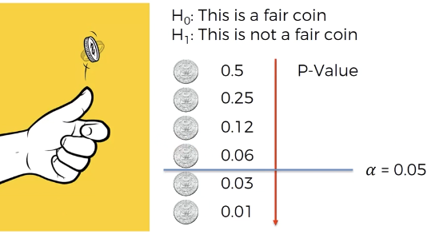

# Mathematics for machine learning
## 1. Statistical significance
- A study is statistically significant if the P value is less than the pre-specified alpha.
- ususaly that values of alpla is **5%**. that is 0.05 chance in 1. 
- Statistical significance represents that a specific Evant is **very less likey to occure**.
- $$ \textrm{Significance} = (1 - P_-value)*100 $$
where,  **0 <= p-value <= 1**.

## Correct way to approach Hypothesis testing.
- **Hypotisis:**  An assumption we make (it is given) about a fact. (Eg: There is no correlation between x and y)

- **Null hypotisis:** (We claim that our assumption is correct), There is no relationship between dependent variable (y) and independent variable (x).

- **Alternative hypotisis :** Is the opposite of the Null hypotisis. There is a relationship between dependent variable (y) and independent variable (x).

- **Note :** P-value: Is the probability that our result is actually significant AND NOT a coincidence. In essence p-value  = Probability-Value.

- If probability of an event happening is less than 5% (Significance) it means that our null hypotisis (assumption) is not correct.
 **Thus,**
- If P-value < 5%(Significance)   For an event to happen there is no way it hapened by coincidence so "you reject the null hypotisis" (There is relation btwn X & Y).

- if P-value > 5%(Significance)  
This is how it's supposed to be so "you don't reject the hypotisis" (NO relation between X & Y).

- **i.e** you 'Exclude' the **'Predictor / Independent variable / Marix of feature '** from the Regression model. 

# Methods of building Models:
1. **All in:** When all Independent variables from a dataset are taken into consideration.
    - Done when having prior knowledge of dataset.
    - Prepearing for backward Eliminatin

2. Stepwise regression
    1. **Backward Elimination :** Follow the Steps
        1. Select a Significance level to stay(eg. 0.05)
        2. Fit the full model with all possible predictors.
        3. consider the predictor with highest P-value. If **( P > SL )**  -> remove
        4. Remove the predictor
        5. Fit model without this variable*
        6. loop 3->5 until no predictor where (p > SL) remain.
    2. **forward Selection :**
        1. Select a significance level to Enter(SL =0.05)
        2. Find P-values for all predictors using Simple regression.
        3. Select the one with lowest p-value
        4. fit all other variable with this  pridictor, and find p-values
        5. consider the pridictor set with lowest P-value. If P < SL,  go to step 3.
        6. Repeat 4 -> 5 until (p > SL)   Exclude current predictor where p > SL and Fit the model.

        

        ### Note:
        Every time a Predictor is added or removed from a model, the P-values and other terms change as well. There for Re-evaluate the values every time while adding / removing variables.     
        
    3. **Bidirectional Elimination**
        1. Select a significance level to STAY (**SL1**) and a significance level to to ENTER (**SLO**).
        2. Perform the next step of Forward Selection   Add when **p <  SLO** to enter.
        3. Perform all steps of backward elimination with the set created through forward selection ( p <  SL1 to stay)   Remove when **p >  SL1**.
        4. repeat until No new variable can enter and no new variables can exit.
        5. Fit the model.
5. **Score Comparison :** Most resource consuming.
    1. Select a criterion of goodness of fit (e.g Akaike criterion)
    2. Construct All possible regression Models **2n - 1** total combinations.  where **n** is number of Predictors.
    3. Select the one with best criterion.
    4. fit the model.

# R squared
$$ R^2 = 1 - \frac {SS_r} {SS_t} $$
**where,**
$$ SS_r = SUM(y_i - y_r)^2 $$
$$ SS_t = SUM(y_i - y_a)^2 $$
yr : coressponding regression value through OLS.  

ya : Average value.
**Note: R2** can be negative. & 'p' represents The number of regressor.
 

### Note: (R squared is Goodness of fit) if R2 is
1. 1.0 --> Perfect fit (suspious)
2. 0.9 --> very good
3. < 0.9 --> Not great
4. < 0.4 --> Terrible
5. < 0 --> Model makes no sense for the data.

## Adjusted R squared.
If we add more Predictors to our model, the **R2** might improve by a lot or a littel bit, but It won't get worse.  This is because the regression model will make the coefficent of newly added variable 0, which in turn will have no effect on  **R2**, it will remain same.
  
Populating the model with too many Useless variables is not ideal, Therefor formula below only considers the variables that have a significant inpact on **R2** .

$$ \textrm{Adj }R^2 = 1 - (1 - R^2) *  \frac {n-1}{n-k-1} $$
where,
- k - number of predictors.
- n - Sample size
